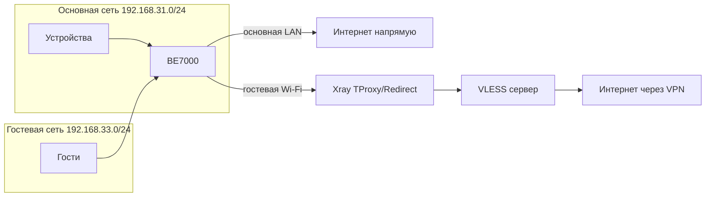

# Обзор проекта

## Что это

**Xiaomi VLESS Panel** — веб-панель на Go для роутера **Xiaomi BE7000** (прошивка XiaoQiang / OpenWrt-подобная). Она управляет клиентом **Xray** и правилами **iptables**, чтобы VPN работал **только в гостевой Wi‑Fi**, а основная домашняя сеть оставалась без прокси.

```
Browser (LAN) → Go panel (:7777) → panel.json
                              → config.json → Xray
                              → startup_xray_guest.sh → iptables
```

### Что делает сервис

| Компонент | Назначение |
|-----------|------------|
| **Веб-панель** | Dashboard, настройки, логи, обновление panel |
| **Xray** | VLESS-клиент: прозрачный прокси для гостевой подсети |
| **iptables** | Перенаправление TCP/UDP трафика гостей через Xray |
| **Подписки** | Загрузка URL подписок, парсинг `vless://` и других ссылок |
| **Failover** | Xray Observatory + balancer при выборе нескольких серверов |
| **Автозапуск** | Скрипты на flash роутера + hotplug USB + cron/procd |

### Схема сети



По умолчанию гостевая подсеть — `192.168.33.0/24`. Её можно изменить в `panel.json`, если на вашем роутере другая.

## Важно: статус проекта

> **Этот репозиторий — не готовое «продуктовое» решение.**  
> Это экспериментальный проект для **ознакомления и самостоятельной доработки**.

Ожидайте:

- ручную настройку и отладку на конкретном роутере;
- зависимость от USB-накопителя и особенностей прошивки Xiaomi;
- отсутствие официальной поддержки и SLA;
- необходимость базовых навыков SSH и понимания VPN/iptables.

Проект развивается автором для личного использования. Используйте на свой риск, делайте резервные копии конфигурации роутера.

## Для кого

- Владельцы **Xiaomi BE7000** с root/SSH-доступом
- Нужен VLESS/Reality **только для гостей**, без VPN на основной сети
- Есть подписка или отдельные `vless://` ссылки
- Готовы подключить USB и пройти [первичную настройку](usage.md#onboarding)

## Что панель не делает

- Не заменяет полноценный VPN-сервис или коммерческий роутерный клиент
- Не гарантирует работу на других моделях Xiaomi без доработки
- Не управляет основной Wi‑Fi сетью через VPN (только гостевая)
- Не включает собственный VPN-сервер — нужен внешний VLESS endpoint

## Связанные документы

- [Подготовка роутера](prerequisites.md)
- [Установка](installation.md)
- [Использование](usage.md)
